# Task Manager

Task Manager is a simple web application for task management. The app allows users to create, edit, delete tasks, work with teams, projects, and organize workflows.

# 🖥️ Check it out 
   ```https://task-track-manager.onrender.com/```

   ⚠️ Important Information
      Please note that the website may experience downtime or instability due to issues with the hosting provider. 
      We are working diligently to ensure stable operation and apologize for any inconvenience caused.

## 🚀 Technologies
The project is built using:
- 🐍 **Backend**: Python + Django
- 🗄️ **Database**: SQLite (local), PostgreSQL (server)
- 🌐 **Frontend**: HTML, CSS
- 🔄 **Version Control**: Git
- 🚀 **Deployment**: Render

## 🔑 Core Logic and Features

- 🔐 **Authentication and Authorization**: Registration, login, password change, and reset via SMTP (Google).
- 👤 **User Profile**:
  - 📊 View productivity statistics: number of active tasks, projects, and completed tasks.
  - ✏️ Edit personal information, change password, and logout.
  - ➕ Create new teams, projects, and tasks.

- 👥 **Teams**:
  - 📋 **Team List**: View all user-associated teams.
  - 🔍 **Team Details**:
    - 🛠️ Edit team information.
    - ➕ Add and ❌ remove team members.
    - 📁 Create projects for the team.

- 📁 **Projects**:
  - 📋 **Project List**: Filter by status, create, and edit projects.
  - 🔍 **Project Details**:
    - 📊 View project tasks.
    - ➕ Add new tasks.
    - 🛠️ Edit and ❌ delete project tasks.

- ✅ **Tasks**:
  - 📋 **Task List**: Filter tasks by status, priority, team, and deadlines.
  - 🔍 **Task Details**:
    - 📝 View task status, priority, deadline, and description.
    - 👤 Assign task executors.
    - 💬 Add and ❌ delete comments.

## 🧩 Database Structure

Main tables:
- 👤 **Worker**: system users (based on AbstractUser).
- 🏷️ **Position**: user role in a team.
- 👥 **Team**: teams with associated members.
- 📁 **Project**: projects related to teams.
- ✅ **Task**: tasks with descriptions, priorities, deadlines, and assignees.
- 💬 **Commentary**: comments for tasks.
- 🔖 **TaskType**: task types for categorization.

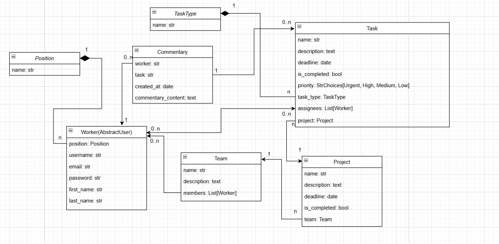

## 📦 Installation

To run the project locally:

1. **Clone the repository**:
   ```bash
   git clone https://github.com/your-username/task-manager.git
   cd task-manager
   ```

2. **Create a virtual environment**:
   ```bash
   python -m venv venv
   source venv/bin/activate  # For Linux/Mac
   venv\Scripts\activate    # For Windows
   ```

3. **Install dependencies**:
   ```bash
   pip install -r requirements.txt
   ```

4. **Configure environment**: Create an `.env` file for configuration.
   ```bash
   # DB
    POSTGRES_DB=<db_name>                     # Name of the Postgres database
    POSTGRES_DB_PORT=<db_port>                # Port of the Postgres database
    POSTGRES_USER=<db_user>                   # Postgres database username
    POSTGRES_PASSWORD=<db_password>           # Postgres database password
    POSTGRES_HOST=<db_host>                   # Host for the Postgres database
    
    # If you do not wish to use Postgres, you can skip these fields and the application will use SQLite by default.
    
    # Django
    SECRET_KEY=<secret_key>                   # Mandatory: Secret key for Django
    DJANGO_SETTINGS_MODULE=<project.settings.prod/dev>  # Mandatory: Specify production or development settings
    RENDER_EXTERNAL_HOSTNAME=<domain>         # Optional: Domain name for external rendering
    
    # Django SMTP
    EMAIL_HOST_USER_SMPT=<admin@gmail.com>    # Optional: SMTP email address for admin
    EMAIL_HOST_PASSWORD_SMPT=<password>       # Optional: SMTP email password
   ```
    **Note:**
    - If POSTGRES_DB and related fields are not set, the project will fall back to using SQLite as the default database.
    - If EMAIL_HOST_USER_SMPT and EMAIL_HOST_PASSWORD_SMPT are not set, the website will still work, but password reset functionality will be disabled.
    - The SECRET_KEY and DJANGO_SETTINGS_MODULE are mandatory and must be provided for the application to run.

5. **Load database data** (if needed):
   ```bash
   python manage.py loaddata dump.json
   ```
   - Data is taken from the `fixture_data.json` file in the root directory.

6. **Run the server**:
   ```bash
   python manage.py runserver
   ```

7. **Open the application**:
   - The server will run at `http://127.0.0.1:8000`

## 🖥️ Deployment

The project is deployed on **Render**. Pre-configured account for login:
- 🔑 **Login**: `admin`
- 🔒 **Password**: `Qw$rty123`

Alternatively, you can **register a new account**.

## 🧩 Project Structure

```
project-root/
├── task_tracker_manager/  # Django configurations (urls, settings)
├── taskhub/               # Application logic (models, views, utils)
│   ├── migrations/        # Database migrations
│   ├── management/        # Custom Django commands
│   │   ├── commands/      # Fixture loading commands
│   │       ├── load_fixture.py
│   ├── admin.py           # Admin panel
│   ├── apps.py            # App configuration
│   ├── context_processors.py # Context processors
│   ├── form.py            # Forms
│   ├── models.py          # Database models
│   ├── tests.py           # Testing
│   ├── urls.py            # URL routing
│   ├── utils.py           # Helper functions
│   ├── views.py           # Request handlers
├── templates/             # HTML templates
├── static/                # CSS and static files
├── fixture_data.json      # Database fixture data
├── manage.py              # Django CLI
├── db.sqlite3             # Local SQLite database
├── requirements.txt       # Dependencies
├── .env                   # Environment variables
└── README.md              # Project description
```

## 🖼️ User Interface

### Welcome Page
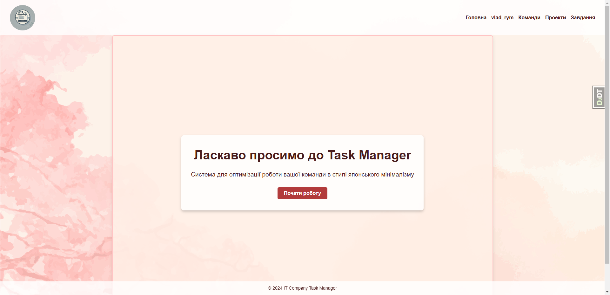


### User Profile
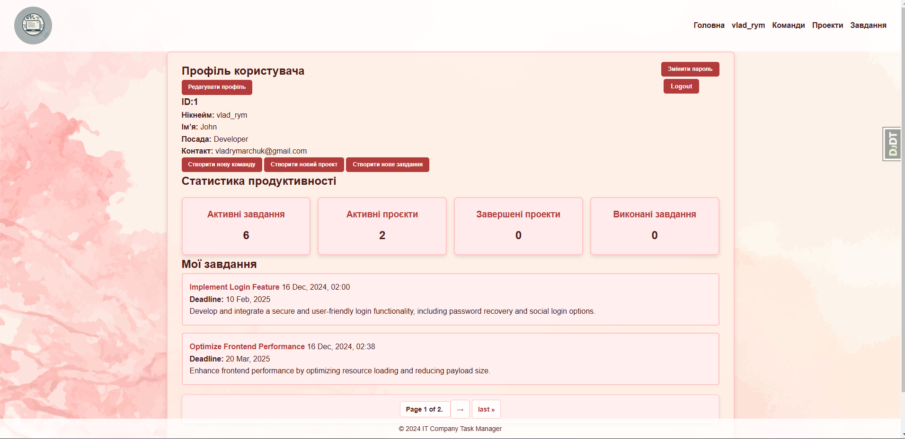

### Update Profile


### List of Teams
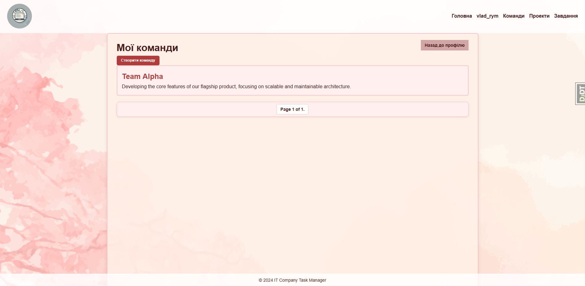

### Detail Team
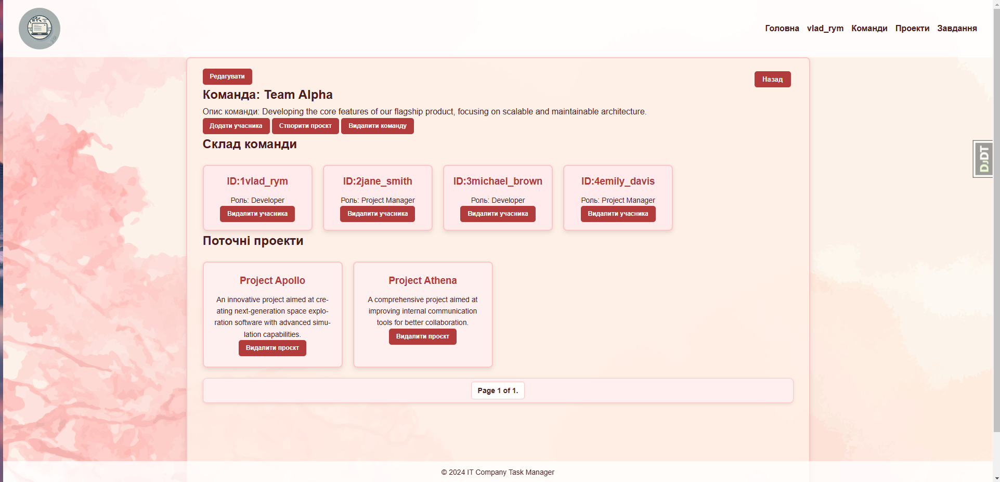

### Update Team
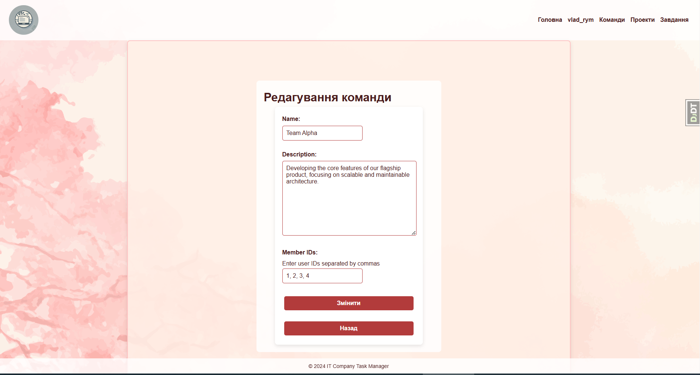


### List of Projects
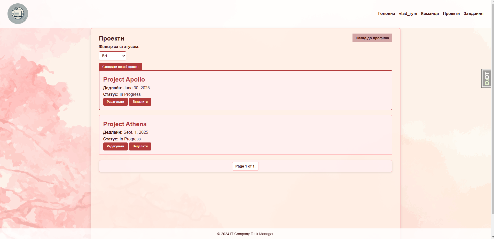

### Detail Project
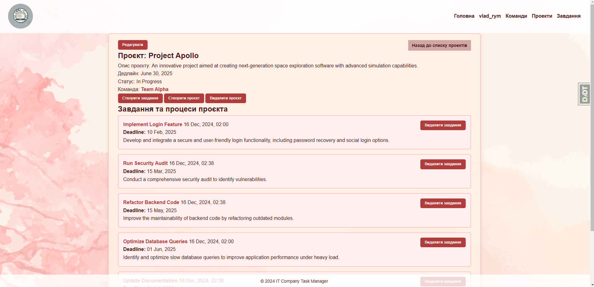

### Update Project
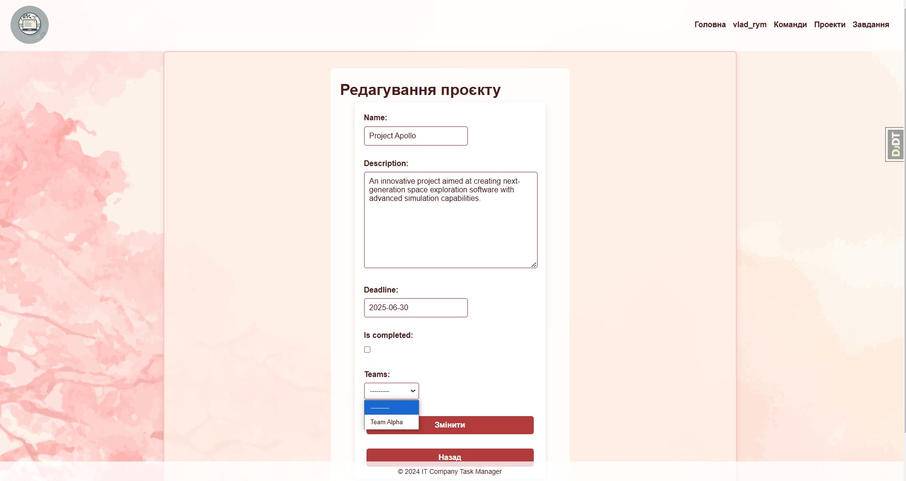


### List of Tasks
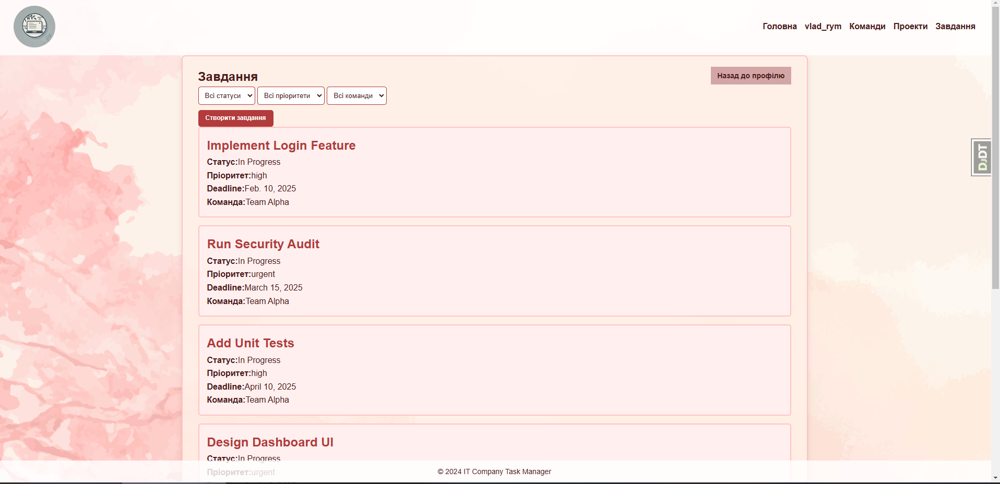

### Detail Task
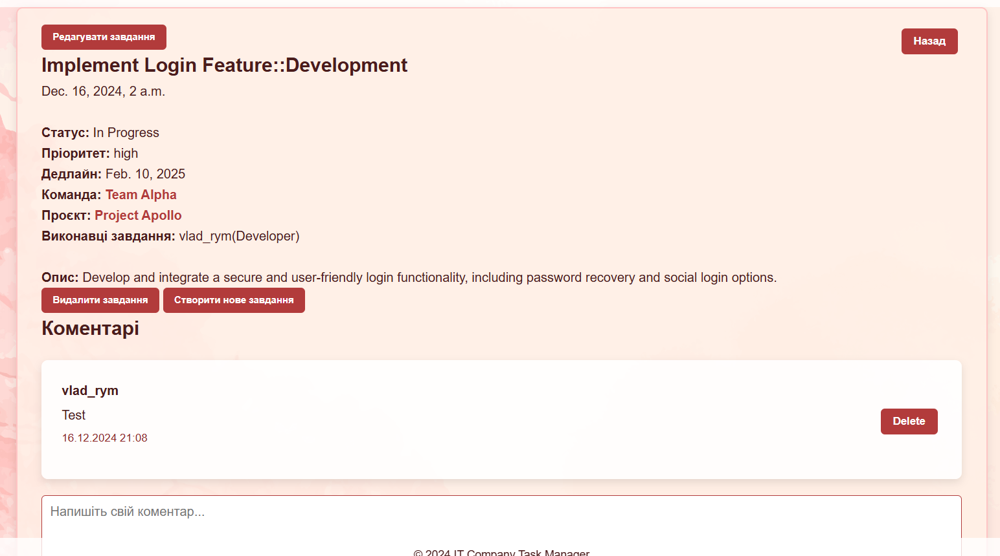

### Update Task
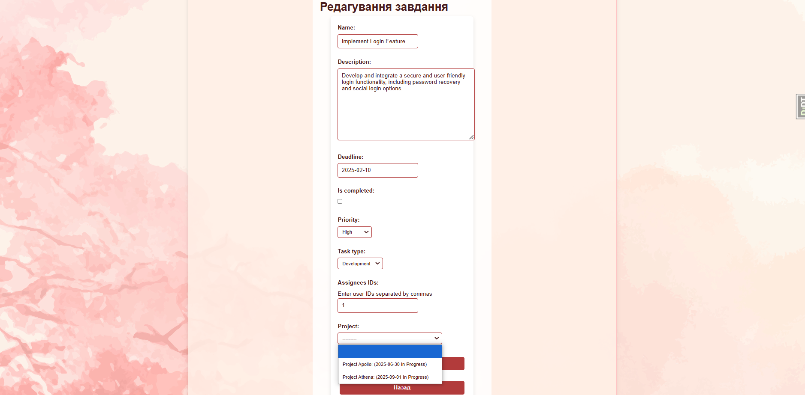


## 👤 Author
**Vladyslav Rymarchuk**  
[GitHub](https://github.com/b4oody/) | [LinkedIn](https://www.linkedin.com/in/%D0%B2%D0%BB%D0%B0%D0%B4%D0%B8%D1%81%D0%BB%D0%B0%D0%B2-%D1%80%D0%B8%D0%BC%D0%B0%D1%80%D1%87%D1%83%D0%BA-aa62a4202/)
